# Autonomous CloudOps AI Platform

## 📌 Overview

Autonomous CloudOps AI Platform is an AI-driven CloudOps and
observability platform designed to automate cloud incident analysis,
troubleshooting, operational decision-making, remediation workflows, and
reporting.

The platform combines AI-agent orchestration, Retrieval-Augmented
Generation (RAG), AWS monitoring, FastAPI services, infrastructure as
code, containerization, Kubernetes deployment tooling, and
observability.

The project demonstrates an end-to-end CloudOps workflow in which a
cloud incident can move through ingestion, contextual retrieval, AI
analysis, remediation planning, approval, remediation, and reporting.

------------------------------------------------------------------------

# 🎥 Live Project Demonstration

## Full Working Demo Video

### ▶️ Part 1
[Watch Autonomous CloudOps AI Platform Demo — Part 1](https://drive.google.com/file/d/1Zje8l1uIW45qLUn0nWP6Aw56BLSBObe1/view?usp=drive_link)

### ▶️ Part 2
[Watch Autonomous CloudOps AI Platform Demo — Part 2](https://drive.google.com/file/d/1_9MC9aTEWA64moes8mVNaWbhleTUevIF/view?usp=drive_link)

The demonstration covers:

- FastAPI Swagger/OpenAPI workflows
- CloudWatch alert ingestion
- AI-agent orchestration using LangGraph
- RAG-based diagnostic workflows
- Grafana observability dashboards
- Incident and remediation workflow visualization
- AWS infrastructure integration
- Container and deployment configuration
------------------------------------------------------------------------

# 📸 Platform Screenshots

## 🔌 Swagger / OpenAPI

### Swagger API Overview

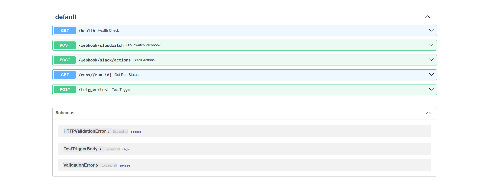

### Incident Trigger API

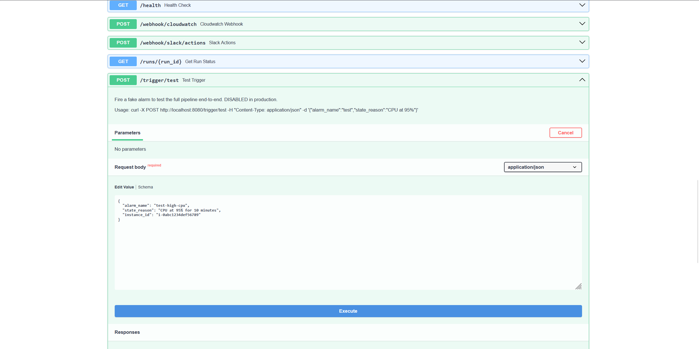

### API Responses

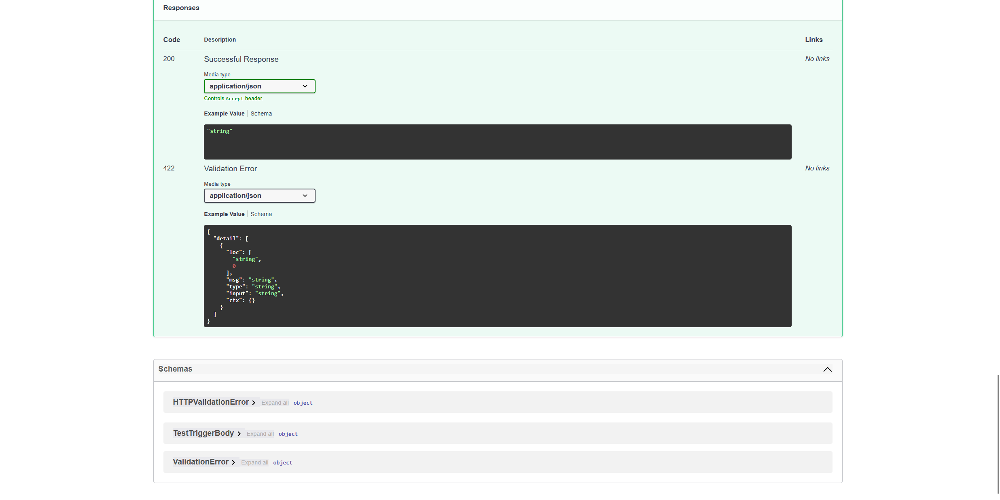

### Swagger Response Validation


### Engineering Highlights

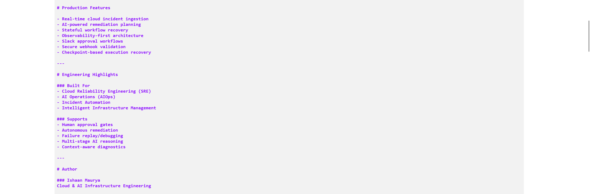

### Runtime Workflow


### Swagger Overview

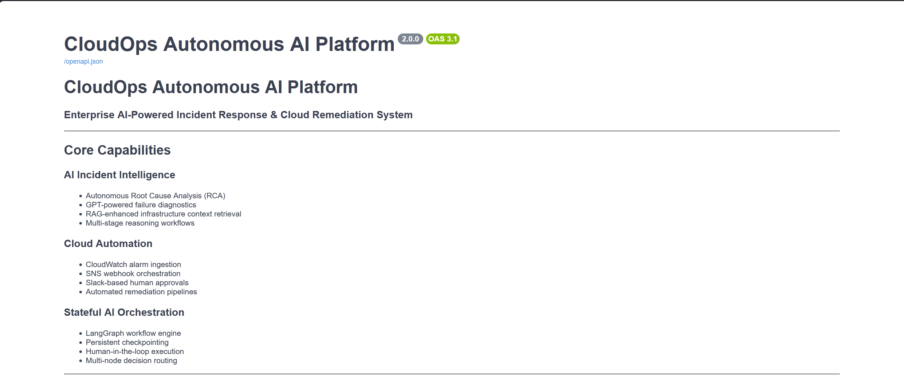

------------------------------------------------------------------------

# 🚨 Incident & Remediation Evidence

## CloudWatch Alarm


## Remediation Result


------------------------------------------------------------------------

# 📊 Grafana Observability

## AI Agent Latency

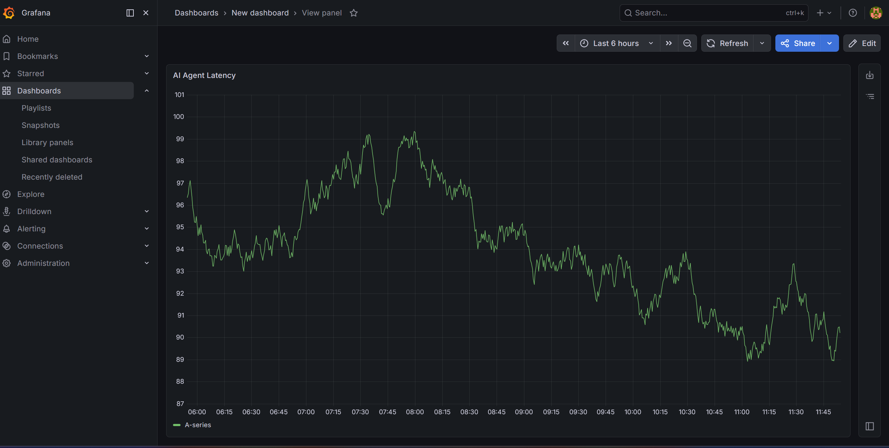

## Alerts Processed

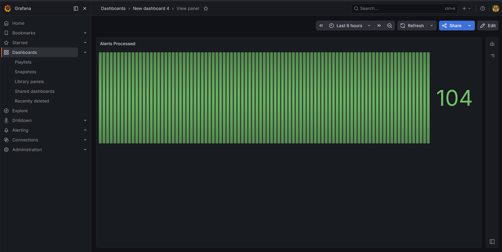

## AWS Cost Trend

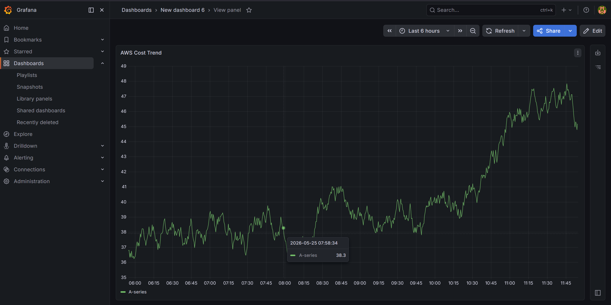

## Failure Rate Dashboard

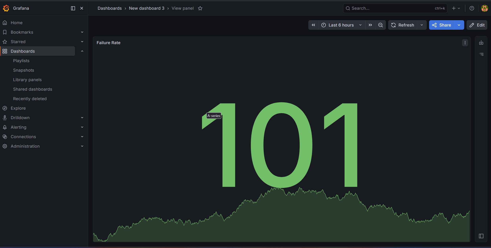

## LLM Token Usage

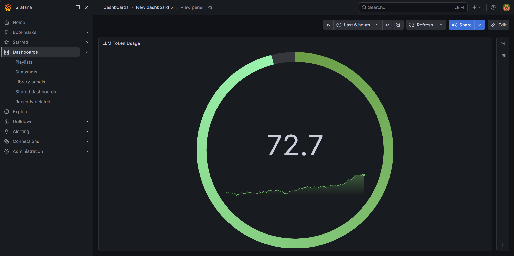

## Remediation Success Rate

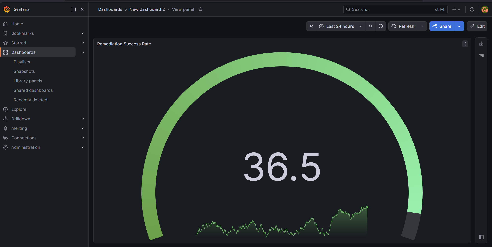

------------------------------------------------------------------------

# 🚀 Key Features

## ✅ AI-Powered Incident Analysis

Processes cloud incidents and operational events through an AI-agent
workflow to analyze context, identify potential causes, determine
severity, and generate operational recommendations.

## ✅ Multi-Agent Workflow Orchestration

Uses LangGraph to coordinate specialized workflow nodes for:

-   Ingestion
-   Analysis
-   Planning
-   Approval
-   Remediation
-   Reporting
-   Cost optimization

## ✅ Retrieval-Augmented Generation

The RAG layer combines embeddings, vector retrieval, AWS documentation,
and operational log context to provide relevant information to the
analysis workflow.

## ✅ FastAPI Backend

Provides REST APIs and Swagger/OpenAPI documentation for:

-   Incident triggering
-   Chat interactions
-   Costs
-   Kubernetes information
-   Logs
-   Metrics
-   Monitoring

## ✅ AWS Cloud Monitoring

Integrates AWS monitoring and cloud infrastructure components, including
CloudWatch-based incident signals.

## ✅ Observability

Provides operational visibility through:

-   Grafana
-   OpenTelemetry
-   CloudWatch
-   Application telemetry
-   AI-agent metrics

## ✅ Infrastructure as Code

AWS infrastructure configuration is maintained using Terraform.

## ✅ Containerized Deployment

The application includes Docker-based containerization and Kubernetes
deployment resources.

## ✅ Kubernetes & GitOps

The repository contains:

-   Kubernetes/EKS configuration
-   Helm deployment templates
-   ArgoCD application manifests

## ✅ Cost Optimization Workflow

The agent architecture includes a dedicated cost optimization workflow
for identifying and analyzing infrastructure cost-related opportunities.

------------------------------------------------------------------------

# 🧠 Problem Statement

Modern cloud environments generate large amounts of:

-   Logs
-   Alerts
-   Metrics
-   Incidents
-   Infrastructure events
-   Operational telemetry

Traditional cloud operations often require engineers to manually:

-   Investigate alerts
-   Search operational logs
-   Inspect metrics
-   Gather infrastructure context
-   Identify possible root causes
-   Research cloud documentation
-   Design remediation steps
-   Validate the result
-   Produce an incident report

This creates repetitive operational work and can increase
incident-response time.

The goal of this project is to demonstrate how AI-agent orchestration
and retrieval systems can be integrated with cloud-native tooling to
automate and assist these workflows.

------------------------------------------------------------------------

# 🏗️ System Architecture

``` text
                    ┌──────────────────────────────┐
                    │       AWS CloudWatch         │
                    │       Alerts / Metrics       │
                    └──────────────┬───────────────┘
                                   │
                                   ▼
                    ┌──────────────────────────────┐
                    │       SNS Notifications       │
                    └──────────────┬───────────────┘
                                   │
                                   ▼
                    ┌──────────────────────────────┐
                    │        FastAPI Webhook        │
                    │        Incident Intake        │
                    └──────────────┬───────────────┘
                                   │
                                   ▼
                    ┌──────────────────────────────┐
                    │    LangGraph Orchestrator     │
                    └──────────────┬───────────────┘
                                   │
             ┌─────────────────────┼─────────────────────┐
             ▼                     ▼                     ▼
      ┌─────────────┐       ┌─────────────┐       ┌─────────────┐
      │   Ingest    │       │   Analyze   │       │    Plan     │
      │    Node     │       │    Node     │       │    Node     │
      └──────┬──────┘       └──────┬──────┘       └──────┬──────┘
             │                     │                     │
             └─────────────────────┼─────────────────────┘
                                   ▼
                    ┌──────────────────────────────┐
                    │        RAG Pipeline          │
                    │                              │
                    │ Pinecone + Embeddings +      │
                    │ AWS Docs + Operational Logs  │
                    └──────────────┬───────────────┘
                                   │
                                   ▼
                    ┌──────────────────────────────┐
                    │     Approval / Remediation   │
                    └──────────────┬───────────────┘
                                   │
                                   ▼
                    ┌──────────────────────────────┐
                    │       Report / Telemetry      │
                    └──────────────┬───────────────┘
                                   │
                                   ▼
                    ┌──────────────────────────────┐
                    │ Grafana + CloudWatch + OTel  │
                    └──────────────────────────────┘
```

------------------------------------------------------------------------

# 🔄 End-to-End Workflow

## Step 1 --- Incident Trigger

A cloud alert or test event enters the FastAPI backend.

Example incident signals include:

-   High CPU utilization
-   Infrastructure anomalies
-   Service issues
-   Operational alerts
-   Cloud monitoring events

------------------------------------------------------------------------

## Step 2 --- Incident Ingestion

The ingestion workflow collects the information required for analysis.

Context can include:

-   Alert metadata
-   Cloud resource information
-   Operational logs
-   Monitoring information
-   AWS documentation
-   Existing operational knowledge

------------------------------------------------------------------------

## Step 3 --- Context Retrieval

The RAG layer retrieves relevant context using:

-   Embeddings
-   Vector similarity search
-   Pinecone
-   AWS documentation
-   Operational logs

The retrieved context is supplied to the analysis workflow.

------------------------------------------------------------------------

## Step 4 --- AI Analysis

The analysis node processes the incident context to:

-   Understand the incident
-   Identify possible root causes
-   Determine severity
-   Analyze supporting evidence
-   Produce diagnostic reasoning
-   Generate recommendations

------------------------------------------------------------------------

## Step 5 --- Remediation Planning

The planning workflow converts the analysis into an operational
remediation plan.

Depending on the incident, the workflow can represent actions such as:

-   Service restart
-   Infrastructure changes
-   Scaling recommendations
-   Operational fixes
-   Cloud resource actions

The repository also contains an approval node so that remediation
workflows can incorporate an approval stage.

------------------------------------------------------------------------

## Step 6 --- Remediation

The remediation node represents the execution stage of the workflow.

The implementation and deployment configuration provide the foundation
for connecting remediation actions with cloud infrastructure.

------------------------------------------------------------------------

## Step 7 --- Reporting

The reporting node produces workflow output and operational information
that can be surfaced through the application and observability layer.

------------------------------------------------------------------------

## Step 8 --- Observability

The system exposes operational information through:

-   Grafana
-   OpenTelemetry
-   CloudWatch
-   Application telemetry

This makes it possible to inspect system behavior and workflow
performance.

------------------------------------------------------------------------

# 🤖 AI Agent Architecture

The `agent/` package contains the workflow orchestration layer.

``` text
                    ┌──────────────────────┐
                    │   LangGraph Graph    │
                    │      graph.py        │
                    └──────────┬───────────┘
                               │
              ┌────────────────┼────────────────┐
              ▼                ▼                ▼
        ┌───────────┐    ┌───────────┐    ┌───────────┐
        │  Ingest   │    │  Analyze  │    │   Plan    │
        └─────┬─────┘    └─────┬─────┘    └─────┬─────┘
              │                │                │
              └────────────────┼────────────────┘
                               ▼
                        ┌─────────────┐
                        │  Approval   │
                        └──────┬──────┘
                               ▼
                        ┌─────────────┐
                        │ Remediation │
                        └──────┬──────┘
                               ▼
                        ┌─────────────┐
                        │   Report    │
                        └─────────────┘
```

### Agent Nodes

  Node                       Responsibility
  -------------------------- ----------------------------------------
  `ingest_node.py`           Collects and prepares incident context
  `analyze_node.py`          Performs incident analysis
  `plan_node.py`             Generates remediation plans
  `approval_node.py`         Represents approval flow
  `remediate_node.py`        Handles remediation workflow stage
  `report_node.py`           Generates workflow/report output
  `cost_optimizer_node.py`   Handles cost-optimization analysis

------------------------------------------------------------------------

# 🔍 RAG Workflow

The RAG subsystem provides contextual knowledge to the AI workflow.

``` text
AWS Documentation
       │
       ▼
Document Ingestion
       │
       ▼
Embedding Generation
       │
       ▼
Pinecone Index
       │
       ▼
Semantic Retrieval
       │
       ▼
Incident Context
       │
       ▼
AI Analysis
```

## RAG Components

  Component                Purpose
  ------------------------ -----------------------------------
  `ingest_aws_docs.py`     Ingests AWS documentation
  `embedder.py`            Generates embeddings
  `setup_indexes.py`       Initializes vector indexes
  `query_engine.py`        Performs retrieval queries
  `diagnosis_engine.py`    Supports diagnostic reasoning
  `live_log_ingestor.py`   Handles operational log ingestion
  `log_fetcher.py`         Fetches operational logs
  `logging.json`           Logging configuration

------------------------------------------------------------------------

# 🛠️ Technologies Used

  Category                 Technologies
  ------------------------ ------------------------
  Backend                  Python, FastAPI
  AI Orchestration         LangGraph
  LLM Integration          Groq
  RAG                      Pinecone, Embeddings
  Cloud                    AWS
  Monitoring               AWS CloudWatch
  Notifications            Amazon SNS
  Observability            Grafana, OpenTelemetry
  Containerization         Docker
  Kubernetes               Kubernetes, AWS EKS
  Deployment               Helm
  GitOps                   ArgoCD
  Infrastructure as Code   Terraform
  Frontend                 React, Vite
  API Documentation        Swagger / OpenAPI
  Testing                  Pytest
  Version Control          Git, GitHub

------------------------------------------------------------------------

# 📂 Project Structure

``` text
AUTONOMOUS-CLOUDOPS-AI/
│
├── agent/
│   ├── graph.py
│   ├── run_events.py
│   ├── state.py
│   │
│   └── nodes/
│       ├── __init__.py
│       ├── analyze_node.py
│       ├── approval_node.py
│       ├── cost_optimizer_node.py
│       ├── ingest_node.py
│       ├── plan_node.py
│       ├── remediate_node.py
│       └── report_node.py
│
├── api/
│   ├── main.py
│   ├── slack_setup.py
│   │
│   └── routes/
│       ├── __init__.py
│       ├── chat.py
│       ├── costs.py
│       ├── kubernetes.py
│       ├── logs.py
│       ├── metrics.py
│       └── monitoring.py
│
├── argocd/
│   └── cloudops-agent-app.yaml
│
├── frontend/
│   ├── src/
│   │   ├── components/
│   │   │   ├── IncidentCard.jsx
│   │   │   ├── MetricsCard.jsx
│   │   │   ├── Navbar.jsx
│   │   │   ├── Sidebar.jsx
│   │   │   └── WorkflowGraph.jsx
│   │   │
│   │   ├── data/
│   │   │   └── mock.js
│   │   │
│   │   ├── pages/
│   │   │   ├── ComingSoon.jsx
│   │   │   ├── Costs.jsx
│   │   │   ├── Dashboard.jsx
│   │   │   ├── Incidents.jsx
│   │   │   ├── Kubernetes.jsx
│   │   │   ├── Logs.jsx
│   │   │   ├── Monitoring.jsx
│   │   │   ├── Settings.jsx
│   │   │   └── Workflow.jsx
│   │   │
│   │   ├── services/
│   │   │   └── api.js
│   │   │
│   │   ├── App.jsx
│   │   ├── index.css
│   │   └── main.jsx
│   │
│   ├── index.html
│   ├── package.json
│   ├── package-lock.json
│   ├── postcss.config.js
│   ├── tailwind.config.js
│   └── vite.config.js
│
├── helm/
│   ├── agent/
│   │   └── templates/
│   │       └── deployment.yaml
│   └── values.yaml
│
├── images/
│   ├── Alarms/
│   ├── Remediation Result/
│   ├── grafana/
│   └── swagger.ui/
│
├── infra/
│   ├── cloudwatch_main.tf
│   ├── eks_main.tf
│   ├── iam_main.tf
│   ├── main.tf
│   ├── variables.tf
│   ├── vpc_main.tf
│   └── grafana/
│       └── grafana_dashboard.json.json
│
├── observability/
│   ├── otel_collector.yaml
│   └── telemetry.py
│
├── rag/
│   ├── diagnosis_engine.py
│   ├── embedder.py
│   ├── ingest_aws_docs.py
│   ├── live_log_ingestor.py
│   ├── log_fetcher.py
│   ├── logging.json
│   ├── query_engine.py
│   └── setup_indexes.py
│
├── tests/
│   ├── advanced_demo.py
│   ├── test_agent.py
│   ├── test_api.py
│   └── test_phase6.py
│
├── Dockerfile
├── INTEGRATION_GUIDE.md
├── PHASE2_COMMANDS.sh
├── PHASE5_COMMANDS.sh
├── PHASE6_COMMANDS.sh
├── pyproject.toml
├── test_imports.py
└── .gitignore
```

------------------------------------------------------------------------

# 📌 Important Components

  Component          Purpose
  ------------------ -------------------------------------------
  `agent/`           LangGraph AI-agent orchestration
  `agent/nodes/`     Specialized workflow nodes
  `api/`             FastAPI application and REST endpoints
  `frontend/`        React/Vite CloudOps dashboard
  `rag/`             Retrieval-Augmented Generation pipeline
  `infra/`           Terraform infrastructure configuration
  `observability/`   OpenTelemetry and telemetry configuration
  `helm/`            Kubernetes deployment templates
  `argocd/`          GitOps deployment manifest
  `images/`          Project screenshots and evidence
  `tests/`           Agent, API, and workflow tests
  `Dockerfile`       Container image definition

------------------------------------------------------------------------

# ☁️ AWS Infrastructure

The platform uses AWS services and infrastructure components for cloud
monitoring, compute, networking, IAM, Kubernetes, and incident
workflows.

The Terraform configuration is organized into infrastructure
modules/files covering areas such as:

-   VPC networking
-   IAM
-   EKS
-   CloudWatch
-   Infrastructure variables
-   Grafana configuration

The infrastructure configuration is located under:

``` text
infra/
```

Key files include:

``` text
infra/main.tf
infra/vpc_main.tf
infra/iam_main.tf
infra/eks_main.tf
infra/cloudwatch_main.tf
infra/variables.tf
```

------------------------------------------------------------------------

# 📈 Observability Layer

The observability subsystem provides visibility into application and
infrastructure behavior.

## Grafana

Dashboards are included for:

-   AI-agent latency
-   Alerts processed
-   AWS cost trends
-   Failure rates
-   LLM token usage
-   Remediation success rate

## OpenTelemetry

The observability configuration includes:

``` text
observability/otel_collector.yaml
observability/telemetry.py
```

The telemetry layer is designed to collect and expose operational
signals for analysis and visualization.

------------------------------------------------------------------------

# 🐳 Docker

The repository contains a `Dockerfile` for containerizing the
application.

Containerization provides a consistent runtime environment for:

-   Local development
-   Testing
-   Deployment
-   Kubernetes workloads

Build the image with:

``` bash
docker build -t autonomous-cloudops-ai .
```

Run the container according to the environment variables and service
configuration required by the application.

------------------------------------------------------------------------

# ☸️ Kubernetes

The project includes Kubernetes-oriented deployment resources.

Deployment tooling includes:

-   Kubernetes
-   AWS EKS
-   Helm
-   ArgoCD

Helm resources are located under:

``` text
helm/
```

ArgoCD configuration is located under:

``` text
argocd/
```

------------------------------------------------------------------------

# 🔁 GitOps

The repository contains an ArgoCD application manifest:

``` text
argocd/cloudops-agent-app.yaml
```

This provides the configuration required to connect the Kubernetes
deployment workflow with GitOps-based deployment management.

------------------------------------------------------------------------

# 🔌 API Layer

The FastAPI backend exposes several functional areas.

``` text
/api
├── chat
├── costs
├── kubernetes
├── logs
├── metrics
└── monitoring
```

The API also provides Swagger/OpenAPI documentation for interactive
testing and inspection.

When running the FastAPI application locally, the interactive
documentation is available at:

``` text
/docs
```

------------------------------------------------------------------------

# 🖥️ Frontend Dashboard

The project includes a React/Vite frontend for visualizing CloudOps
information.

The frontend contains pages for:

-   Dashboard
-   Incidents
-   Workflow
-   Monitoring
-   Kubernetes
-   Logs
-   Costs
-   Settings

It also contains reusable components for:

-   Incident cards
-   Metrics cards
-   Navigation
-   Sidebar navigation
-   Workflow visualization

------------------------------------------------------------------------

# 🔐 Configuration & Secrets

The project uses environment-based configuration for sensitive
credentials and service configuration.

Create your local `.env` file from the required variables.

**Never commit `.env` or cloud credentials to GitHub.**

The repository `.gitignore` excludes:

``` text
.env
.env.*
.venv/
.terraform/
*.tfstate
*.tfstate.*
*.tfvars
node_modules/
```

For collaborative development, create an `.env.example` containing
variable names only and no secret values.

------------------------------------------------------------------------

# 🧪 Testing

The project includes tests covering different parts of the platform.

Examples include:

``` text
tests/test_agent.py
tests/test_api.py
tests/test_phase6.py
tests/advanced_demo.py
test_imports.py
```

Run the test suite with the project's configured Python test
environment.

For example:

``` bash
pytest -v
```

------------------------------------------------------------------------

# 🔬 Development Workflow

A typical local development workflow is:

``` text
Clone Repository
      │
      ▼
Create Python Environment
      │
      ▼
Install Dependencies
      │
      ▼
Configure Environment Variables
      │
      ▼
Start FastAPI Backend
      │
      ▼
Start React Frontend
      │
      ▼
Trigger / Test Incident
      │
      ▼
Inspect Agent Workflow
      │
      ▼
Inspect API / Grafana / CloudWatch Output
```

------------------------------------------------------------------------

# 📊 Example Use Cases

## 🚨 Automated Incident Analysis

Process cloud monitoring events and provide AI-assisted analysis of
incident context.

## 🔍 Intelligent Log Analysis

Retrieve and analyze operational logs as part of the incident-diagnosis
workflow.

## 🧠 RAG-Assisted Troubleshooting

Use retrieved AWS documentation and operational context to support
incident analysis.

## 💰 Cost Optimization

Use the cost-optimization agent workflow to identify infrastructure
cost-related opportunities.

## 🔧 Remediation Workflows

Generate and process remediation plans through an orchestrated approval
and remediation workflow.

## 📈 Cloud Observability

Visualize infrastructure and AI-agent telemetry through Grafana and
OpenTelemetry.

------------------------------------------------------------------------

# 🔄 Example Incident Flow

``` text
┌─────────────────────┐
│ CloudWatch Alert    │
└──────────┬──────────┘
           │
           ▼
┌─────────────────────┐
│ SNS Notification    │
└──────────┬──────────┘
           │
           ▼
┌─────────────────────┐
│ FastAPI Webhook     │
└──────────┬──────────┘
           │
           ▼
┌─────────────────────┐
│ Ingest Node         │
└──────────┬──────────┘
           │
           ▼
┌─────────────────────┐
│ RAG Retrieval       │
│ Pinecone + Logs     │
│ + AWS Documentation │
└──────────┬──────────┘
           │
           ▼
┌─────────────────────┐
│ Analyze Node        │
└──────────┬──────────┘
           │
           ▼
┌─────────────────────┐
│ Plan Node           │
└──────────┬──────────┘
           │
           ▼
┌─────────────────────┐
│ Approval Node       │
└──────────┬──────────┘
           │
           ▼
┌─────────────────────┐
│ Remediation Node    │
└──────────┬──────────┘
           │
           ▼
┌─────────────────────┐
│ Report Node         │
└──────────┬──────────┘
           │
           ▼
┌─────────────────────┐
│ Observability       │
│ Grafana / OTel      │
└─────────────────────┘
```

------------------------------------------------------------------------

# 📚 Concepts Demonstrated

This project demonstrates practical work across:

-   CloudOps
-   DevOps
-   Site Reliability Engineering
-   AI Agents
-   LangGraph orchestration
-   Retrieval-Augmented Generation
-   Vector databases
-   Cloud monitoring
-   Incident response
-   Infrastructure as Code
-   Terraform
-   Docker
-   Kubernetes
-   AWS EKS
-   Helm
-   ArgoCD
-   OpenTelemetry
-   Grafana
-   FastAPI
-   REST APIs
-   React
-   Observability engineering
-   Cloud cost optimization

------------------------------------------------------------------------

# 🔮 Future Improvements

Potential future improvements include:

-   Expanded autonomous remediation execution
-   Kubernetes self-healing workflows
-   Additional AWS service integrations
-   Multi-cloud support
-   Slack / Microsoft Teams integrations
-   Real-time observability streaming
-   More advanced cost optimization automation
-   Security incident response agents
-   Expanded CI/CD automation
-   Production-grade approval and policy controls
-   More extensive automated testing
-   Additional incident playbooks

------------------------------------------------------------------------

# 🎯 Learning Outcomes

This project demonstrates practical experience with:

-   Designing AI-integrated cloud systems
-   Building FastAPI backend services
-   Orchestrating multi-step AI workflows
-   Implementing RAG pipelines
-   Integrating vector search with operational context
-   Working with AWS monitoring
-   Building infrastructure with Terraform
-   Containerizing applications with Docker
-   Designing Kubernetes deployment workflows
-   Implementing GitOps concepts
-   Building observability pipelines
-   Developing cloud operations dashboards
-   Testing agent and API workflows

------------------------------------------------------------------------

# 📌 Current Status

**Prototype / Research-Oriented CloudOps Automation Platform**

The platform currently contains the core AI-agent, RAG, API, frontend,
AWS infrastructure, observability, containerization, Kubernetes, and
deployment components required to demonstrate an end-to-end CloudOps
automation workflow.

The project is under active enhancement and experimentation.

------------------------------------------------------------------------

# 👨‍💻 Author

**Ishaan Maurya**

GitHub: [Ishaan-37](https://github.com/Ishaan-37)

------------------------------------------------------------------------

# ⭐ Project Highlights

``` text
AI Agents
     +
RAG
     +
AWS
     +
FastAPI
     +
Terraform
     +
Docker
     +
Kubernetes
     +
Grafana
     +
OpenTelemetry
     +
GitOps
     =
Autonomous CloudOps AI Platform
```

------------------------------------------------------------------------

## 📄 License

No license has been specified for this repository yet.
